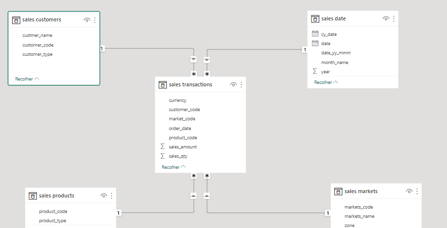

# Vendas da AtliQ Hardware 
### Projeto de Análise Exploratória com linguagem SQL

Neste projeto analítico, viso apresentar em detalhes uma análise exploratória de dados executada com linguagem SQL sob o conjunto de dados relativo às vendas da empresa AtliQ Hardware, que é uma empresa indiana que oferta vários produtos para computador (dispositivos periféricos), tal como mouses, teclados e digitalizadores.


Os objetivo desta análise exploratória são **(1)** extrair o máximo de informações valiosas atinentes aos negócios e às vendas da empresa, e **(2)** obter informações estatísticas sobre a tendência de vendas da empresa ao decorrer dos anos, para podermos saber se à demanda pelos produtos da empresa estão em crescimento ou em queda.

5 tabelas estão disponíveis para a análise neste conjunto de dados:

* customers: Informações sobre os clientes da empresa
* date: Informações dos anos, meses e datas sobre às vendas da empresa
* markets: Informações relativa às cidades da Índia em que tal empresa é localizada
* products: Informações sobre os produtos que a empresa comercializa
* transactions: Informações sobre às vendas realizadas e registradas pela empresa

As 5 tabelas são relacionadas representativamente através do modelo de estrela abaixo:



O modelo de estrela (star-schema) explicita acima que às 4 tabelas (customers, date, markets, products) são tabelas-dimensão que estão relacionadas diretamente com a tabela transactions que é a tabela-fato, a tabela-fato é caracterizada por ter vários eventos registrados historicamente durante determinado período de tempo, enquanto a tabela-dimensão é caracterizada por conter várias informações complementares aos eventos registrados.

Em suma, a tabela transactions é a tabela-fato por conter todos os registros de todas às vendas realizadas pela empresa durante vários anos, enquanto às de mais tabelas-dimensões são responsáveis por conter informações adicionais que complementam às informações sobre às vendas da empresa.

Concluída a explicação acima sobre a relação entre às tabelas, o processo de análise foi inicializado:

#### Exploração dos dados:

Antes de começar às análises sobre os negócios da empresa, decidi saber de antemão a quantidade de linhas contidas em cada tabela que será analisada:

```
# Quantidade de linhas na tabela customers:

SELECT COUNT(*) AS 'qtd_rows' FROM customers;
```
38 linhas na tabela 'customers'

```
# Quantidade de linhas na tabela date:

SELECT COUNT(*) AS 'qtd_rows' FROM date;
```
1.126 linhas na tabela 'date'

```
# Quantidade de linhas na tabela markets:

SELECT COUNT(*) AS 'qtd_rows' FROM markets;
```
17 linhas na tabela 'markets'

```
# Quantidade de linhas na tabela products:

SELECT COUNT(*) AS 'qtd_rows' FROM products;
```
279 linhas na tabela 'products'

```
# Quantidade de linhas na tabela transactions:

SELECT COUNT(*) AS 'qtd_rows' FROM transactions;
```
148.395 linhas na tabela 'transactions'

Normalmente, a tabela-fato contêm mais linhas do que a tabela-dimensão, nesse caso, por exemplo, a tabela-fato transactions contêm 148 mil linhas, enquanto às de mais tabelas-dimensões contêm pouquíssimas linhas armazenadas.

Após essa verificação breve da extensão do conjunto de dados, o processo de análise foi devidamente inicializado com algumas questões básicas:

#### (1) Qual foi a receital total faturada pela empresa?

Antes de escrever a query que trouxesse a resposta para a pergunta acima, decidi saber os anos em que essa empresa já está ativa no mercado:

```
# Anos em que a empresa está ativa:

SELECT DISTINCT(d.year) FROM date AS d;
```

A query acima retornou a tabela abaixo:

| year |
|------|
| 2017 |
| 2018 |
| 2019 |
| 2020 |

Como é informado na tabela acima, 2017, 2018, 2019 e 2020 são os anos respectivos em que a empresa estava ativa no mercado e que os dados de vendas da empresa foram coletados.

Após isto, escrevi a query para saber a receita total faturada pela empresa desde 2017 até 2020:

```
# Receita total da empresa faturada desde 2017 até 2020:

SELECT SUM(t.sales_amount) AS 'revenue' FROM transactions AS t;
```

A query acima retornou:

|  revenue  |
|-----------|
| 984813463 |

Acima é constatável que 984 milhões de rupees (moeda indiana) foi o faturamento total da empresa durante esses anos (2017-2020), que convertido para o dólar americano seria aproximadamente 11 milhões de dólares faturado pela empresa indiana.

#### (2) Qual foi a média de faturamento da empresa por venda?

Tal pergunta é complementar à pergunta anterior, e para responder rapidamente tal questão, escrevi a query abaixo:

```
# (2) Qual é a média de faturamento da empresa?

SELECT ROUND(AVG(t.sales_amount), 2) AS 'avg_revenue' FROM transactions AS t;
```
A query acima retornou:

| avg_revenue |
|-------------|
|   6636.43   |

Em média, tal empresa obteve um faturamento de 6 mil rupees por cada venda realizada durante esse período de quatro anos (2017-2020), que convertido em dólar seria 79 dólares em média faturados pela empresa em cada venda.

Após responder tais questões básicas, resolvi aprofundar-me sobre o faturamento da empresa durante cada período anual:

#### (3) Quais foram os anos em que a empresa obteve mais faturamento?

A query abaixo responde essa pergunta acima:

```
SELECT d.year, SUM(t.sales_amount) AS 'revenue' FROM transactions AS t
INNER JOIN date AS d 
ON d.date = t.order_date
GROUP BY d.year
ORDER BY revenue DESC;
```

Como retorno a query acima, obtive essa tabela abaixo:

| year | revenue   |
|------|-----------|
| 2018 | 413687163 |
| 2019 | 336019102 |
| 2020 | 142224545 |
| 2017 | 92882653  |

A tabela acima traz o faturamento da empresa em cada ano ordenado decrescentemente do ano de maior faturamento até o ano de menor faturamento.

Visivelmente, 2017 foi o ano de menor faturamento da empresa de 92 milhões de rupees (1 milhão de dólares), enquanto 2018 foi o ano de maior faturamento de 413 milhões de rupees (4 milhões de dólares), e como é observável após 2018 a empresa começou a apresentar uma queda no faturamento em 2019 e em 2020.

Respondida a pergunta relativa ao faturamento anual da empresa, decidi saber quais são os meses de maior ou menor faturamento da empresa:

#### (4) Durante esses anos, quais foram os meses de maior faturamento da empresa?

Query escrita em SQL para responder a pergunta acima:

```
SELECT d.month_name, SUM(t.sales_amount) AS 'revenue' FROM transactions AS t
INNER JOIN date AS d
ON d.date = t.order_date
GROUP BY d.month_name
ORDER BY revenue DESC;
```

Com a query acima, obtive essa tabela abaixo:

| month_name| revenue  |
|-----------|----------|
| January   | 99707625 |
| November  | 92895782 |
| March     | 92757526 |
| February  | 89349947 |
| April     | 88804291 |
| December  | 84759270 |
| May       | 83514075 |
| October   | 80519194 |
| June      | 74792837 |
| August    | 71657508 |
| July      | 71087048 |
| September | 54968360 |


Visivelmente, Janeiro foi o mês de maior faturamento da empresa de aproximadamente 99 milhões de rupees (1 milhão de dólares), enquanto Setembro foi o mês de menor faturamento de 54 milhões de rupees (662 mil dólares), e também é constatado que os primeiros meses do ano (de Janeiro até Maio) são os meses de maior faturamento da empresa, enquanto da metade do ano em diante, isto é, de Junho até Outubro a empresa apresenta uma queda de faturamento mensal, com exceção de Novembro e Dezembro que foram meses de alto faturamento.

Mesmo que o faturamento seja uma informação importante da empresa, é imprescindível saber informações sobre a lucratividade e a margem de lucro que a empresa obteve durante esse período de tempo:

#### (5) Quais foram os anos de maior lucratividade da empresa?

Query escrita para responder a questão acima:

```
SELECT d.year, ROUND((SUM(t.sales_amount) - SUM(t.cost_price)), 2) AS 'profit' FROM 
transactions AS t INNER JOIN date AS d
ON t.order_date = d.date
GROUP BY d.year
ORDER BY profit DESC;
```
Tabela com os lucros monetários da empresa divididos por ano:

| year |   profit    |
|------|-------------|
| 2019 | 10486543.89 |
| 2018 | 9337296.15  |
| 2017 | 2717568.03  |
| 2020 | 2060160.34  |

Interessantemente, 2018 foi o ano de maior faturamento, porém 2019 foi o ano de maior lucratividade da empresa, enquanto em contrapartida 2017 foi o ano de menor faturamento, mas 2020 foi o ano que a empresa obteve menos lucros em seus investimentos.

Com a tabela acima, é notável que a empresa apresentava um aumento contínuo de seus lucros de 2017 até 2019, porém em 2020 a empresa obteve uma queda drástica nos retornos lucrativos de seus investimentos.

Entretanto, para continuar nesse tópico relativo aos lucros da empresa, decidi saber qual foi a porcentagem de lucro relativo ao faturamento total da empresa em cada ano:

#### (6) Qual foi a margem de lucro da empresa por ano?

Query escrita para responder tal pergunta:

```
SELECT d.year, ROUND((SUM(t.profit_margin) / SUM(t.sales_amount)) * 100, 2) AS 'margin_profit' FROM
transactions AS t INNER JOIN date AS d
ON d.date = t.order_date
GROUP BY d.year
ORDER BY margin_profit DESC;
```
Abaixo obtive a tabela com a margem de lucro da empresa em cada ano:

| year | margin_profit|
|------|--------------|
| 2019 |    3.12      |
| 2017 |    2.99      |
| 2018 |    2.26      |
| 2020 |    1.45      |

Como esperado, 2019 foi o ano de maior lucratividade e também foi o ano em que a empresa indiana obteve a maior margem de lucro relativo à seus investimentos (de 3 %), enquanto 2020 que foi o ano de menor lucratividade, também foi o ano em que a empresa obteve a menor proporção de lucro em relação ao faturamento total obtido no ano (de 1 %).

Porém, qual foi o custo de produção da empresa em cada ano? Será que os anos mais lucrativos foram os anos mais custosos para a empresa? Ou será que inversamente, os anos menos lucrativos foram os mais custosos? 

#### (7) Qual foi o custo de produção da empresa por ano?

Query escrita em SQL para responder tal pergunta:

```
SELECT d.year, ROUND(SUM(t.cost_price), 2) AS 'cost' FROM transactions AS t
INNER JOIN date AS d
ON d.date = t.order_date
GROUP BY d.year
ORDER BY cost DESC;
```
Tabela com os custos de produção da empresa dividido por ano:

| year |    cost      |
|------|--------------|
| 2018 | 404349866.85 |
| 2019 | 325532558.11 |
| 2020 | 140164384.66 |
| 2017 | 90165084.97  |

Como é informado acima, os anos mais lucrativos (2018, 2019) foram os anos mais custosos para a empresa, enquanto os anos menos lucrativos foram os anos menos custosos (2017, 2020), tal insight poderia fornecer hipoteticamente a explicação de que 2020 e 2017 foram os anos menos lucrativos por terem sido os anos que a empresa menos investiu em produção e fornecimento de mais produtos.

Respondida à questão, decidi explorar dados relativos à quantidade de vendas realizada pela empresa:

#### (7) Qual foi o total de vendas da empresa?

Query escrita para responder a questão acima:

```
SELECT SUM(sales_qty) AS 'qtd_sales'FROM transactions;
```
Como retorno obtive:

| qtd_sales |
|-----------|
|  2429282  |

Ou seja, durante esses quatro anos (2017-2020), a empresa realizou estimadamente 2 milhões de vendas.

E por ano? Quais foram os anos que a empresa realizou mais vendas?

#### (8) Qual foi o total de vendas realizadas por ano?

Query escrita em SQL para trazer a resposta para a questão acima:

```
SELECT d.year, SUM(t.sales_qty) AS 'qtd_sales' FROM transactions AS t
INNER JOIN date AS d ON d.date = t.order_date
GROUP BY d.year 
ORDER BY qtd_sales DESC;
```
Tabela retornada como resultado:

| year | qtd_sales |
|------|-----------|
| 2018 |   997497  |
| 2019 |   847083  |
| 2020 |   350240  |
| 2017 |   234462  |

Como expectante, 2018 e 2019 que foram os anos de maior faturamento e de maior lucratividade, também foram os anos de mais vendas acumuladas pela empresa, enquanto 2017 e 2020 que foram os anos de menor faturamento e lucratividade, também foram os anos de menos vendas acumuladas.

Após explorar a tabela de transações (transactions) da empresa, decidi explorar a tabela de mercados para saber como estão os negócios da empresa em cada cidade da Índia que tal empresa é localizada:

#### (9) Quais são as cidades da Índia em que tal empresa é localizada?

Escrevi essa query abaixo para saber quais são às cidades na Índia em que tal empresa é localizada:

```
SELECT DISTINCT(markets_name) FROM markets
WHERE markets_name NOT IN ('New York', 'Paris');
```
Como retorno, obtive essa tabela abaixo com os nomes das cidades que AtliQ Hardware está presente:

| markets_name |
|--------------|
| Chennai      |
| Mumbai       |
| Ahmedabad    |
| Delhi NCR    |
| Kanpur       |
| Bengaluru    |
| Bhopal       |
| Lucknow      |
| Patna        |
| Kochi        |
| Nagpur       |
| Surat        |
| Hyderabad    |
| Bhubaneshwar |

Com os nomes das cidades indianas obtidos, decidi escrever uma query para obter o número de cidades indianas em que a empresa indiana está localizada:

```
SELECT COUNT(DISTINCT(markets_name)) AS 'qtd_city' FROM markets
WHERE markets_name NOT IN ('New York', 'Paris');
```
Como retorno obtive:

| qtd_city |
|----------|
|    14    |

Em 14 cidades diferentes na Índia há pelo menos uma loja da empresa AtliQ Hardware presente.

Após saber quais são às cidades em que a loja AtliQ Hardware está presente, quis saber quais são às 5 cidades em que a empresa obteve maior faturamento e lucratividade:

#### (10) Quais são às 5 cidades da Índia, que tal empresa obteve maior lucratividade e faturamento?

Query escrita em SQL para responder tal questão acima:

```
SELECT m.markets_name, SUM(t.sales_amount) AS 'revenue', 
ROUND((SUM(t.sales_amount) - SUM(t.cost_price)), 2) AS 'profit' FROM transactions AS t
INNER JOIN markets AS m
ON m.markets_code = t.market_code
GROUP BY markets_name
ORDER BY revenue DESC, profit DESC
LIMIT 5;
```
Obtive a tabela abaixo como resposta:

| markets_name |  revenue  |   profit    |
|--------------|-----------|-------------|
|  Delhi NCR   | 519514271 | 11898298.52 |
|  Mumbai      | 150084801 | 4872639.77  |
|  Ahmedabad   | 132307441 | 2848268.51  |
|  Bhopal      | 58609861  | 2287149.69  |
|  Nagpur      | 55026321  | 1412109.72  |

Delhi NCR foi a cidade indiana que trouxe o maior faturamento e os maiores lucros para a empresa, as lojas em tal cidade obtiveram um faturamento de 519 milhões de rupees (6 milhões de dólares) e um lucro de 11 milhões de rupees (143 mil dólares).

Como informação complementar à está questão, quis saber:

#### (11) Quais são às 5 cidades da Índia, que tal empresa obteve menor lucratividade e faturamento?

Escrevi a query abaixo para ter uma resposta à pergunta acima:

```
SELECT m.markets_name, SUM(t.sales_amount) AS 'revenue', 
ROUND((SUM(t.sales_amount) - SUM(t.cost_price)), 2) AS 'profit' FROM transactions AS t
INNER JOIN markets AS m
ON m.markets_code = t.market_code
GROUP BY markets_name
ORDER BY revenue DESC, profit DESC
LIMIT 5
OFFSET 10;
```
Obtive como retorno:

| Lucknow      | 3094007 | 31161.21  |
|--------------|---------|-----------|
| Lucknow      | 3094007 | 31161.21  |
| Surat        | 2605796 | 126677.05 |
| Bhubaneshwar | 893857  | 35596.36  |
| Bengaluru    | 373115  | -77534.96 |

Destacavelmente, Bengaluru foi a única cidade que trouxe prejuízo para a empresa AtliQ Hardware, um prejuízo de aproximadamente 77 mil rupees (936 dólares), enquanto tal cidade obteve o menor faturamento de 373 mil rupees (4 mil dólares) para a empresa.

Respondida essas duas questões, explorei os custos de produção da empresa por cada cidade:

#### (12) Qual foi o custo de produção da empresa em cada cidade?

Query escrita em SQL para responder a pergunta acima:

```
SELECT m.markets_name, ROUND(SUM(t.cost_price), 2) AS 'cost_of_production'
FROM transactions AS t
INNER JOIN markets AS m
ON m.markets_code = t.market_code
GROUP BY markets_name
ORDER BY cost_of_production DESC;
```
Obtive como retorno à tabela abaixo:

| markets_name | cost_of_production |
|--------------|--------------------|
| Delhi NCR    |    507615972.48    |
| Mumbai       |    145212161.23    |
| Ahmedabad    |    129459172.49    |
| Bhopal       |    56322711.31     |
| Nagpur       |    53614211.28     |
| Kochi        |    18110176.01     |
| Chennai      |    17742129        |
| Kanpur       |    13648487.45     |
| Hyderabad    |    7389865.78      |
| Patna        |    4246132.22      |
| Lucknow      |    3062845.79      |
| Surat        |    2479118.95      |
| Bhubaneshwar |    858260.64       |
| Bengaluru    |    450649.96       |

Como é notável, às cidades que geram mais lucros e faturamento para a empresa, são às cidades que geram mais custos também, já Bengaluru que é a única cidade que gerou prejuízos para empresa durante todos esses anos, também foi a cidade que teve os menores custos de produção de 450 mil rupees (5 mil dólares).

